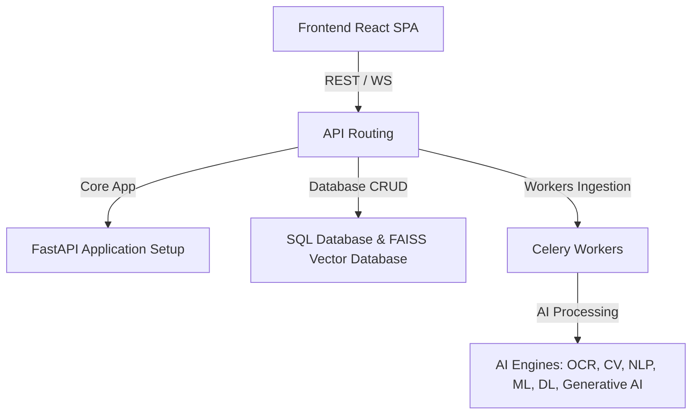

# System Architecture

The AI Document Intelligence System is built as a modular application with top-level root modules.

## Architecture Layout

The application has the following logical components:

- **App Settings (`app/`)**: Manages settings, FastAPI setup, and core dependencies.
- **REST endpoints (`api/`)**: Dispatches tasks and handles HTTP and WebSocket client traffic.
- **Data models (`models/`)**: Defines database schemas mapped via SQLAlchemy.
- **Database sessions (`database/`)**: Handles SQL connection transactions.
- **AI Core (`ai/`)**: Segmented engines that clean images, run OCR models, generate embeddings, perform vector retrieval, search duplicates, and generate RAG responses.
- **Background tasks (`workers/`)**: Executes celery routines to offload ingestion overhead from API threads.
