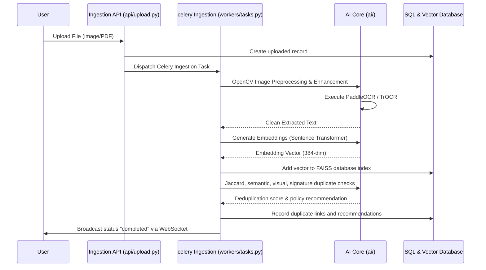

# Document Processing Workflow

This document details the step-by-step pipeline execution for file ingestion, analysis, deduplication, and RAG.

1. **Upload & Preprocess**: Documents are uploaded, enhanced via OpenCV, and deskewed/denoised.
2. **Text Extraction (OCR)**: Scanned text is transcribed using EasyOCR/PaddleOCR or TrOCR models.
3. **Embedding Generation**: The cleaned text is encoded into dense vectors using Sentence Transformers.
4. **Vector Database**: Embeddings are stored in FAISS and BM25 databases.
5. **Deduplication Engine**: Calculates Jaccard overlap, semantic distance, and visual correlations (mean squared error & ResNet features).
6. **RAG & Chat**: Retrieves vector contexts and prompts Gemini LLMs to answer chatbot Q&As.
